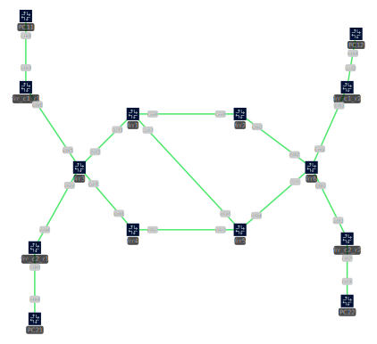

# SRv6 Lab Topology with FRR


### Host System Requirements:

- tested on Ubuntu Noble, kernel 6.8.0-64:

```bash
leo@containerlab:~$ uname -a
Linux containerlab 6.8.0-64-generic #67-Ubuntu SMP PREEMPT_DYNAMIC Sun Jun 15 20:23:31 UTC 2025 x86_64 x86_64 x86_64 GNU/Linux
leo@containerlab:~$ cat /etc/lsb-release
DISTRIB_ID=Ubuntu
DISTRIB_RELEASE=24.04
DISTRIB_CODENAME=noble
DISTRIB_DESCRIPTION="Ubuntu 24.04.2 LTS"
```

- add following configs for sysctl (needed for SRv6 working properly)

``` bash
leo@containerlab:~ cat /etc/sysctl.d/99-custom.conf
# Run sudo sysctl --system to apply these changes
#
net.ipv4.conf.all.forwarding=1
net.ipv6.conf.all.forwarding=1
net.ipv6.seg6_flowlabel=1
net.ipv6.conf.all.seg6_enabled=1
net.vrf.strict_mode=1

```

### Validation
```bash
leo@containerlab:~/labs/clab-srv6-frr$ ./validation-vpns.sh

PC-to-PC Connectivity Validation
================================

Client 1:
✅ PC11 (192.168.11.2) <-> PC12 (192.168.12.2)
✅ PC11 (c1:1:feed::2) <-> PC12 (c1:2:feed::2)
✅ PC11 (192.168.11.2) <-> PC13 (192.168.13.2)
✅ PC11 (c1:1:feed::2) <-> PC13 (c1:3:feed::2)
✅ PC12 (192.168.12.2) <-> PC13 (192.168.13.2)
✅ PC12 (c1:2:feed::2) <-> PC13 (c1:3:feed::2)

Client 2:
✅ PC21 (192.168.21.2) <-> PC22 (192.168.22.2)
✅ PC21 (c2:1:feed::2) <-> PC22 (c2:2:feed::2)
✅ PC21 (192.168.21.2) <-> PC23 (192.168.23.2)
✅ PC21 (c2:1:feed::2) <-> PC23 (c2:3:feed::2)
✅ PC22 (192.168.22.2) <-> PC23 (192.168.23.2)
✅ PC22 (c2:2:feed::2) <-> PC23 (c2:3:feed::2)
================================
```

### References:
I took inspiration from:

- [SRv6 Simulation with FRR](https://bun.pages.forge.hefr.ch/docs/netsimulation/FRR/srv6/#simulation)
- [Containerlab frr example](https://containerlab.dev/lab-examples/frr01/)
- [Onvox SRv6 FRR](https://onvox.net/2024/12/16/srv6-frr/)
- [PoC FRR SRv6 L3VPN](https://www.linkedin.com/pulse/poc-frrouting-srv6-l3vpn-ipv4-ipv6and-wireguard-vpn-gonzalez-diaz)