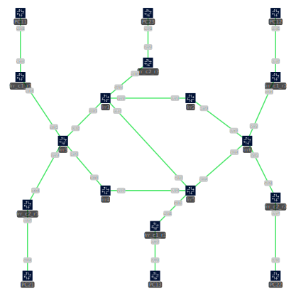

I took inspiration from:

- [SRv6 Simulation with FRR](https://bun.pages.forge.hefr.ch/docs/netsimulation/FRR/srv6/#simulation)
- [Containerlab frr example](https://containerlab.dev/lab-examples/frr01/)
- [Onvox SRv6 FRR](https://onvox.net/2024/12/16/srv6-frr/)
- [PoC FRR SRv6 L3VPN](https://www.linkedin.com/pulse/poc-frrouting-srv6-l3vpn-ipv4-ipv6and-wireguard-vpn-gonzalez-diaz)

### Host System Requirements:

- kernel version > ?
- add following configs for sysctl (needed for SRv6 working properly)

``` bash
leo@containerlab:~ cat /etc/sysctl.d/99-custom.conf
# Run sudo sysctl --system to apply these changes
#
net.ipv4.conf.all.forwarding=1
net.ipv6.conf.all.forwarding=1
net.ipv6.seg6_flowlabel=1
net.ipv6.conf.all.seg6_enabled=1
net.vrf.strict_mode=1

```